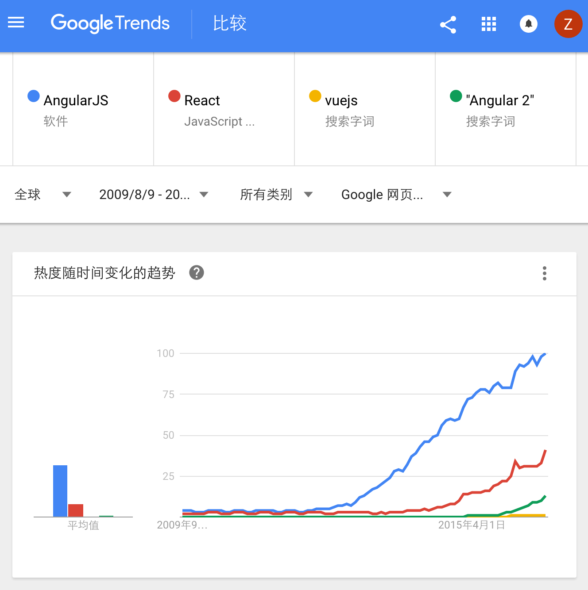

# 开篇寄语：Angular —— 王者归来！

来自[Google Trends](https://www.google.com/trends/explore?date=2009-08-09%202016-09-09&q=%2Fm%2F0j45p7w,%2Fm%2F012l1vxv,vuejs,%22Angular%202%22)

## 过去

一图抵千言。

从这张图上可以看出几项前端技术在全球范围内的成长趋势。可以看到Angular 1当年的积累与爆发！

不过，这些不是重点，本文要谈论的是这条代表Angular 2的绿线。

Angular 2从2014年初对外公布开发计划，到现在已经两年半有余。期间，共经历了56个alpha、18个beta、8个rc。相信这样一个巨型开源项目组的倾力奉献有资格承担你的信任与期待！

## 现在！

发这篇文章，是因为Angular 2的Milestone中已经没有新的RC计划，这意味着Angular的API已经稳定，准备最后发布了。当然，剩下的周边任务还是很多的：修复bug、完善文档、完善生态等等。即使你不是早鸟，现在也应该开始学习它了！

可以说这是为现实项目储备Angular 2技能的最佳时机。

如果要学习Angular 2，显然，各种学习资源是必不可少的。这里先列出一些参考资料供大家入门：

1. [英文官网](https://angular.io)
    > 如果你英文很好，那么英文官网将是最好的学习资料。显然，作为官方开发组亲自维护的文档站，无论是权威程度还是更新速度，都是最好的。

1. [中文官网](https://angular.cn)
    > 如果你读英文还有困难，那么请访问这个中文官网。这是我和一位留学生朋友对英文官网的翻译版，并得到了官方开发组的承认和推荐。今后一旦官网有更新，我们也会保持同步翻译 —— 虽然这很累，但值得！

1. [Angular中文社区微信号](https://wx.angular.cn)
    > 请识别关注我们。从今天起，官方微信号将正式启用，这意味着这里将会频繁发表Angular 2和前端开发的相关文章、新闻等。所有这些文章都会被存档到<https://wx.angular.cn>。
    
    > 同时，Angular中文社区在InfoQ等技术媒体上发表的文章也都会在这里存档。同时，我们的一个问答栏目也在建设中，这是一个基于Github API的手机版开源论坛，争取早日为大家提供服务。

1. Angular中文社区系列QQ群
    - 278252889（ Angular 中文社区，2000人已满）
    - 305739270（ Angular 中文社区二群，2000人）
    - 207542263（ Angular 中文社区三群，1000人）
    - 200242234（ Angular 互助组，500人）
    - 110455272（ Ionic 开发实践，500人）

## 未来！

古人云：知易行难。学习Angular 2的最佳方式是实践。除了自己做学习项目之外，也可以学习别人的开源项目，比如<https://github.com/angular-bbs/user-ui>是本网站的全套源码，而<https://github.com/greengerong/rebirth>是一个开源的个人博客项目。

不过目前如果你要在实际项目中使用它，还是要慎重一点。

首要的障碍在于它不支持IE8，所以如果要继续支持，还是继续使用Angular 1.2吧。

其次，它仍然没有Final Release，如果你们团队中没有能坐镇的资深前端，建议还是等两个月再尝试使用它，到时候的社区支持就会完善得多，各种坑也基本上都暴露出来了。

最后，先**不要**把既有项目迁移到Angular 2。即使Angular 2提供了相当明确的升级路径，升级也仍然是一个技术活儿，工作量也不小。在你对Angular 2相当熟悉之前，建议只用小规模的新项目进行试点。原有的Angular 1项目最好按照官方提供的最佳实践进行重构，完成重构之后，迁移起来就容易多了。
