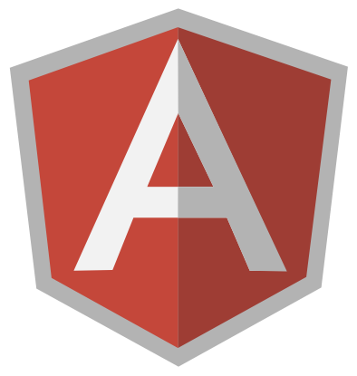
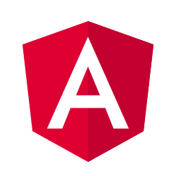

# 弯道超车！后端程序员的Angular快速指南

## 开篇寄语 —— 弯道超车，为时未晚

前端领域如火如荼，工资水平也水涨船高。作为后端程序员的你，羡慕吗？但羡慕是没用的，更别提嫉妒恨了。古人曰：与其临渊羡鱼，不如退而结网。接下来，我不但要教你结网，还要教你后端程序员弯道超车的秘诀。我将对前端领域的概念进行简要说明，并尽量用后端领域的概念来类比前端的概念，由于笔者的个人背景所限，可能会更多使用Java世界的概念类比，不过.net等世界也大同小异。

笔者就是从后端程序员转型而来，深知阻挠后端程序员转型的那些拦路虎。比如：陌生的工具链、陌生的语言、庞杂的W3C标准、不一样的设计风格、不一样的编码风格等等，不过最大的拦路虎是……框架太多。每套框架都号称自己有一系列优点，让人眼花缭乱，无从抉择。

事实上，对于前端程序员来说，在这些框架之间进行选择确实很困难，因为有时候前端程序员会过于沉迷细节。比如，他/她可能在50毫秒和100毫秒的响应时间之间举棋不定，可能会因为实现细节上的优点，而忽略项目管理和可维护性上的代价。最严重的问题可能还是在于：误判了前端需求的增长速度和工程化开发的重要性，而这正是后端程序员们弯道超车的好时机。

## 细说从头

以2004年Gmail的推出为起点，前端领域已经呈现出爆炸性增长，经过十多年的成长，它是否即将进入停滞期？我只能说“Too young, too naive!”。当Web初兴的时候，同样有编写传统桌面应用的程序员觉得它会很快成长到停滞期，不过结果大家都已经看到了。在我看来，并不是什么“前端编程技术”横空出世了，而是它的需求一直都存在，却由于技术条件不足而被压抑着 —— 直到Web技术成熟到能把它释放出来，这才导致了前端横空出世并急速膨胀的假象。

回忆一下，在“前端”的概念诞生之前，我们是怎样实现一个Web应用的？我们会先在服务器上合成一段HTML，然后把它发回给浏览器；之后，几乎任何操作都会向服务器发送一个请求，服务器再渲染一个完整的新页面发回来。跳出习惯性思维，反思一下：这是自然的吗？我们为什么会需要如此复杂的过程？这其实原本是被迫做出的妥协：在从Netscape诞生开始的很长时间内，浏览器中的JS都是一个“玩具语言（这是JS之父说的）”：语法繁杂、坑多、解释器性能低下、无模块化机制、无成熟的工具链，无成熟的第三方库等等，JS程序员（如果当时有的话）也毫无悬念的占据了鄙视链的底端。面对JS这样一位“猪队友”，程序员们还能怎么办？只能求助于万能的服务端语言了：它几乎不会受到浏览器的制约，可以自由使用所需的一切编程资源。幸运的是，Web技术的标准化工作在这个过程中得以蹒跚前行，而JS的标准化工作也在三大浏览器巨头的博弈中艰难的前进着。

Chrome，特别是V8引擎的诞生，终于结束了JS解释器的性能问题，更重要的是，基于V8引擎，诞生了伟大的NodeJS。NodeJS就是前端世界的JRE或.net CLR。它主要有三大贡献：

1. 让JS语言“入侵”了后端世界和桌面世界。
>这在前端开发的襁褓期有效扩大了JS语言的适用范围，积累了大量第三方库，很多第三方库只要在合适的工具支持下也能在前端领域正常使用。
1. 为前端开发提供了工具链。
>如今的前端世界，其工具链的复杂度和完善度已经逐渐逼近后端世界，比如：类似于gradle的构建工具gulp、grunt，类似于maven的包管理工具npm，类似于junit的测试框架karma等等，它们无一例外，都是基于NodeJS的。
1. 提供了标准化的模块化方案CommonJS。
>在NodeJS诞生之前，模块化一直是JS世界的短板，虽然也有不少相互竞争的JS模块化方案，却都没能一统江湖，这主要是因为当时的很多前端应用都过于简单，对模块化并没有迫切需求。而随着NodeJS入侵到后端世界和桌面世界，模块化成了不得不做的事情，于是NodeJS内置的CommonJS就成为了事实性的标准。JS的最新版本ES6中内置的模块化机制就是类似于CommonJS的。

与此同时，在另一条战线上，还有一些技术在平行推进，那就是前端DOM库与前端框架。在2006年，一个名叫jQuery的DOM库横空出世，它封装了复杂的、特定于浏览器的DOM操纵类API，让程序员可以不必处理一些繁琐的细节差异，从而简化了浏览器中的DOM编程。在那个时代，虽然尚未正式提出“前端”的概念，不过已经出现了不少事实上的前端程序。但这些前端程序相对于如今包罗万象的前端还是过于原始了，很多前端代码都只是嵌入在后端页面中的龙套。不过，这些程序就像最早爬到岸上的鱼一样，带人们发现了一个新世界，对前端程序的需求也随之井喷。什么是“前端程序”呢？在我看来主要有如下几个特征：

1. 客户端渲染
>与传统上借助后端生成新页面的方式不同，前端程序借助浏览器的API来呈现内容（也就是“渲染”）并处理用户动作，在这个过程中，并不需要借助服务端的运算能力，也不需要网络。
1. 单页面
>客户端渲染技术衍生出的一个主要特征是单页面应用。因为不需要再由服务器发回新页面，所以前端程序在理论上就具备了独自渲染内容并全权处理用户交互的能力，只在必要时，才会通过Web API寻求服务器的帮助。
1. 实时反馈
>客户端渲染技术衍生出的另一个主要特征是实时反馈。在传统的应用中，除非内嵌JS代码，否则任何反馈都需要由服务端代码生成并发回，而且编程相对复杂。这导致很少有程序能够给出实时反馈，即使做到了实时反馈的，也会因为网络延迟等问题而损害用户体验，而专业的前端程序则可以借助客户端运算轻松实现实时反馈。

随着技术的进步，前端终于具备了摆脱“石器时代”的条件，于是，前端的时代终于要开始了。

## 前端时代！

以jQuery为代表的DOM库在使用中逐渐暴露出了很多缺点，特别是混杂逻辑代码和操纵DOM的代码导致难以维护。于是一大批新的前端`MV*`框架悄然出现了。框架不同于库：库是一组被动式的代码，如果你不调用它，它就什么都不做；而框架不同，框架提供了启动、事件处理等各种通用性代码，你按照框架规约写自己的代码，并把它“告诉”框架，框架会在合适的时机用合适的方式调用它们。确实，这没什么新鲜的，你早就用过Spring或asp.net了，不是吗？从这一点上来说，前端框架与后端框架大同小异。不过，前端框架还是有自己的鲜明特色的：

1. 它们是……用JS写的。
>毫无疑问，JS尽管有各种不完善，但它目前是并且仍将是前端世界的霸主，我认为其中最重要的原因是：它是各大浏览器厂商利益的最大公约数。Google曾孵化了一个在浏览器和后端共用的语言Dart，不过现在连自己的浏览器都不打算直接支持它了。从技术上讲，Dart无疑是相当先进的，但现实却更加残酷。
1. 它们是弱类型的。
>受限于JS的能力，前端框架无法访问运行时类型（就像Java或.net中的反射机制），也就无法像后端框架那样大量借助接口来定义扩展方式。因此，框架只能借助一些复杂的技巧来达成目标。当然，后续的技术发展在一定程度上改变了这一点，那就是微软的新语言TypeScript的诞生，我们稍后再展开这个话题。
1. 它们是灵活的。
>得益于JS的动态特性和弱类型特性，前端框架也非常灵活，比如你可以把任意对象传给调用者，只要这个对象有调用者所需的属性或方法即可，而不用像Java那样明确定义接口。灵活，是优点，也是缺点 —— 在小规模、需求稳定的程序中，它可以极大的提高开发速度，用过Ruby或者Python的程序员大概深有体会；但在大规模、需求频繁变化的程序中，它将是BUG之源，用过Ruby或Python的程序员大概深有体会。
        
那些年，前端`MV*`库的竞争，其激烈程度几乎不下于各种语言的竞争。2009年，一个注定要名声大噪的框架加入了这场前端`MV*`大战，它叫Angular。

## Hello, Angular！

Angular的英文原意是“角”，也就是“锐角、直角”的“角”。它的主要开发者是Adobe Flex的开发者Misko以及很多来自Google的后端程序员，因此它有很多理念和概念来自于Flex和后端编程领域，如声明式界面（Declarative UI）、服务（Service）、依赖注入（Dependency Injection）等，并为单元测试提供了优秀的支持。可以说，它天生就有后端基因，其设计目标也是处理像传统后端一样复杂的需求。幸运或者不幸的是，它仍然是一个前端框架。它具有高度的灵活性 —— 既可以写得很规整，也可以写得很烂。当然，在某种意义上，这不应该算作Angular的问题，而是JS的“原罪”。

这种情况意味着，如果有成熟的最佳实践和优秀的开发规范，Angular程序可以写得很漂亮：简洁明了、模块清晰、分层明确、关注点分离。但在开发组意识到社区需要一份来自官方的开发规范之前，Angular 0.x和1.x版本的烂代码和坏习惯已经泛滥成灾了。

幸运的是，Angular有一个繁荣、强大的社区，社区在行动。无论是英文社区还是中文社区，都出现了一些优秀的Angular工程师，他们总结出了一些经验和教训，并给出了自己的解决之道，全凭自己的力量与热情在社区中传播。如果你是一个后端程序员，会发现这些最佳实践和开发规范似曾相识。没错，很多优秀的Angular工程师本来就是后端工程师出身。这并不奇怪，前端岁月尚浅，优秀的前端工程师当然会有很多是从优秀的后端工程师转型而来的。

但这还不是根本原因。在有些人的思维中，前端和后端好像是两个截然不同的世界。并非如此！编程之道本来就是互通的，并不存在前端的编程之道和后端的编程之道。主导这两个开发领域的设计原则不外乎就是`SOLID`等少数几个，无论是前端的编程规范还是后端的编程规范，都是对这些原则的实例化。

社区的努力，在一定程度上弥补了Angular早期版本的缺憾，但，这还不够。我们需要一份官方的开发规范，甚至，一个更好的Angular。后者才是重点！

## Hello, Angular 2！

优秀的框架特性、繁荣的社区、广泛的应用，但都被ES5（JS的早期版本）这个猪队友给拖累了，另一个猪队友则是老版本浏览器 —— 特别是IE8及更低的版本。于是，就在Angular 1.x如日中天的时候，Angular开发组高调开始了新版本的开发工作，它就是Angular 2！这里还有很多小插曲按下不表，等我有时间开杂谈时再慢慢说。

Angular 2本身不再是用ES5写成的，而是TypeScript，简称TS。TS是微软开发的一个新语言，它是ES6的超集，这意味着，凡是有效的ES6代码都同样是有效的TS代码；另一方面，ES6是ES5的超集，所以凡是有效的ES5代码也同样是有效的TS代码。但是在ES6的基础上，TS增加了可选的类型系统以及未来的ES8中才会出现的装饰器等特性。你想知道TS为什么这么牛？很简单，因为他爸是 —— 不，不，不是李刚，他爸是**Anders Hejlsberg**，如果Java程序员没听说过他还情有可原，如果是.net程序员，那就自己去面壁思过吧 —— 他是微软.net的总架构师，C#语言之父，更资深的程序员可能还用过Delphi，那是Anders的“长子”。一个人设计了三个流行的工业级语言，也真是够了。

虽然TS已经诞生了很久，但却一直没有流行起来，这主要是因为它还缺少一个“杀手级应用”。现在，Angular 2来了！

在摆脱了一个猪队友之后，Angular 2终于可以随心所欲的展示自己的风采了，比如：基于类型的依赖注入、强类型的库文件、更加便捷的语法、标准化的模块化机制等等，无法一一列举。

但还有另一个猪队友在拖后腿，那就是老式浏览器，对，说的就是你 —— IE 8！Angular从1.3开始就彻底抛弃了它，2.x就更不用说了。有一阵子，曾经传言Angular 2不支持IE 11以下所有版本的IE，不过幸好，Angular开发组终于对现实做出了妥协，否则这又会是一个重大的公关危机了。能与IE 8说再见，真好。不过，这也意味着，当你准备开始用Angular 2做项目的时候，务必先跟客户或产品经理敲定不需要支持IE 8，否则还是老老实实用Angular 1.2吧。

## Angular 2，后端之友

在Angular 1中就从后端借鉴过很多概念，到Angular 2自然就更进一步了。这些概念对没有做过后端开发的新前端来说会有一定的难度，不过对后端程序员来说这不过是小菜一碟。接下来我们就逐个讲讲。

### 服务与依赖注入

没错，它们跟后端的服务与依赖注入是同一个概念，只是在实现细节上略有不同。

后端的服务是一个单例，在Angular 2中同样如此；后端的服务是使用类型来注入的，在Angular 2中同样如此，不过由于TS的限制，Angular 2中通常会根据类进行注入，而不是像传统的后端程序那样优先使用接口；后端的依赖注入器是由框架提供的，Angular 2中同样如此；后端的依赖可以进行配置，Angular 2中同样如此，不过它的配置方式更加灵活，它不需要单独的配置文件（该死的XML），而是直接用程序代码，这赋予了它额外的灵活性，却几乎没有损失（这让我想起了Grails）。

不过Angular 2的依赖注入体系比传统的后端更加灵活，它是一棵由多个注入器组成的树，这棵树跟组件树平行存在。你可以把局部使用的服务放在中下层节点上，来限制它的作用范围，减小耦合度；你可以预留一些占位（Placeholder）服务，等待调用方实现它，以达到“用组合代替继承”的效果（要了解详情，请自行分析`LocationStrategy`的设计）；可以在不同的层级上配置同一个类的不同依赖实例，这样它就可以覆盖掉上层的配置，在必要时临时建立一个“独立王国”。

### 可选强类型

强类型是很多Java程序员信心的保障，但同时也因为过于繁琐而饱受抨击。

现在，它随着TS又来到了前端世界。不过不用害怕Java世界中的悲剧重演，因为TS中的强类型是“可选”强类型。这意味着你可以完全不定义变量、属性、参数等的数据类型，TS编译器也会照样放行。当你需要快速建立一个原型时，这种特性会非常有用，因为你不用现在就做很多决策。但当有一天你的原型经历了从产品经理到CEO的重重考验，终于修成正果的时候，你会发现它“太烂”了。这是好事，这说明你的开发过程中没有浪费精力。但如果你想继续像这样把它发展成一个产品级应用，那就要悲剧了。因为代码中有太多只有你自己知道的约定和隐式接口，但新过来和你进行合作开发的人是无法和你心灵相通的。用不了多久，本来就是一团面条的代码就变成了一坨浆糊，然后你就开始了无止境的加班岁月。没错，“福兮祸之所依”，现实就是这么残酷。

为了走得更远，你先得为代码中的变量、属性、参数等标上数据类型、抽象出接口，并且基于它们建立相应的开发规范（最好能用持续集成(CI)工具进行保障）。有了这些，即使是两个负情商的大老爷们儿也能轻松做到“心灵相通”了。

加完类型之后，你仿佛回到了自己所熟悉的后端领域。现在，你的地盘儿，你做主！

### 测试驱动开发

如果测试驱动开发还不是你的基本功，那可能说明你在后端开发方面还有短板。即使你不是想做全栈，而是想完全转型成前端，也应该补习一下测试驱动开发的技能。因为未来的前端开发，即使在纯逻辑类代码的复杂度上都可能会赶上后端。

在1.x的时代，Angular就以其优秀的“可测试性”而著称了，Angular 2当然不会放弃这个传统优势。Angular 2的单元测试更加简单，我还是直说吧：Angular 2中单元测试的方式更像后端。在Angular 1.x的时代，单元测试中不得不使用诸如`$controller`（如果你不懂，请忽略它）等框架内部API，而Angular 2测试框架的设计中完全封装了它们，当你测试一个组件时，大部分时候几乎就是在测试一个普通的类。

传统的前端程序员可能不太容易理解测试驱动开发的思维方式，特别是对于没有什么后端经验的资深前端。这也同样是后端程序员实现弯道超车的好机会。随着前端职责的加重，在前端代码中，会出现越来越多的复杂逻辑，这些复杂逻辑如果没有测试驱动开发的保障，将被迫用“写代码、切换到浏览器、界面上点点看看、切换回IDE”的低效循环进行开发，更重要的是，它很容易诞生高度耦合、恰好能用的烂代码。但在测试驱动开发的保障下，可以先从最简单的规约开始，逐步补充更多规约。在开发过程中，你只要不时瞥一眼IDE的测试控制台就可以了。这样不但开发起来更快，而且可以收获良好的代码结构，因为容易测试的代码通常也都是松耦合的。

### 分工，1+1 > 2

后端程序员学习前端技术时，往往会为HTML/CSS等头疼不已，这些都是相对陌生甚至完全陌生的领域，如果急于为团队贡献生产力，那么请把这些“后背”交给你的队友。

延续Angular的一贯传统，Angular 2对团队分工提供了卓越的支持，它通常会把一个界面分成模板（`*.html`、`*.jade`）、样式（`*.css`、`*.scss`、`*.less`、`*.styl`）、组件（`*.js`、`*.ts`）和组件单元测试（`*.spec.ts`、`*.spec.js`）等几个基本名（base name）相同的文件，它们被放在独立文件中但能很好的相互协作。

当你的前端技能还在蹒跚学步的时候，请放心的写下一些粗糙的HTML/CSS代码，比如用div搭建出丑陋但能与你所写的组件顺畅协作的html文件。然后，提交它，等你的队友帮你把它修成漂亮的产品级界面。同样的，如果你的前端队友还不太清楚该如何干净漂亮的从组件中抽取出服务，那么你就可以放心的帮他/她修改组件代码，而不用担心无意间破坏了模板和样式。

一个团队中，如果能有谦逊的super star当然好，但这种团队是可遇而不可求的，更现实的期望是一个能相互信任、各尽所能的团队。而Angular在设计时就充分考虑了团队分工的需求，要想建设这样一个团队，毫无疑问，Angular将是你的首选平台！

## 结束语 —— Angular 2，全栈养成计划

好吧，我承认我可耻的做了一次标题党。本文并非在煽动后端程序员去革前端程序员的命，而是希望无论是前端程序员还是后端程序员，都能成长为优秀的全栈程序员（是的，前端程序员如果理解了Angular 2中的这些概念也会更容易向后端发展）。全栈程序员由于能有效节省沟通成本（比如不用频繁协商API）而被很多开发组织寄予厚望，但真正培养起来可没那么容易。

有一阵子，培养全栈程序员的期望被放在了Fullstack JavaScript上 —— 它既能写前端程序又能写后端程序还能写桌面程序。不过事实证明，这种期望落空了。即使经过了大爆发，NodeJS在企业应用开发、大数据等领域的资源积累也远远不及Java、C#、Python，甚至将来还有被新崛起的Scala和Go超越的危险。

或许我们应该换一种思路了：全栈一定要用同一种语言写前端和后端吗？并非如此。事实上，我们更应该看重的是编程模型、思维方式和协作模式等方面的复用，而语言层面只是细枝末节而已。所以，Java或C#，加上TS与Angular 2，给出了培养全栈的新曙光。相似的概念模型、相似的思维方式、相似的协作模式，这才是全栈程序员真正的核心技能，与语言无关。

这些，才是Angular 2给专业开发团队带来的，最珍贵的礼物！
