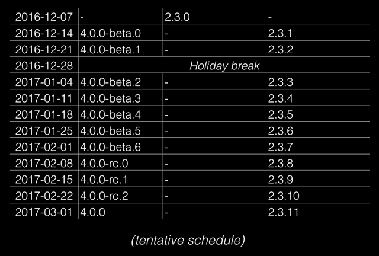
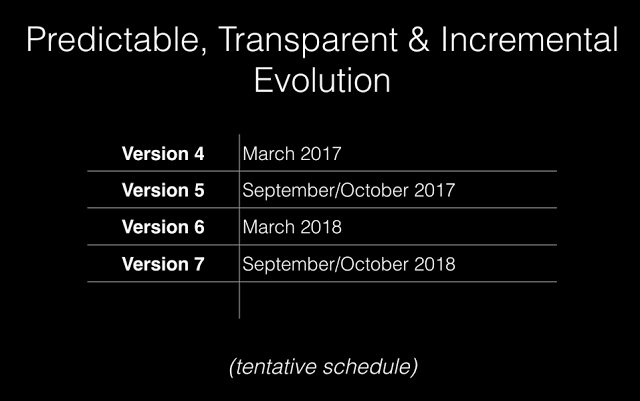
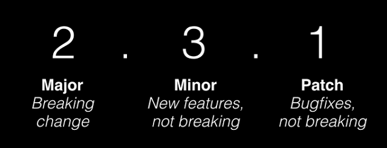
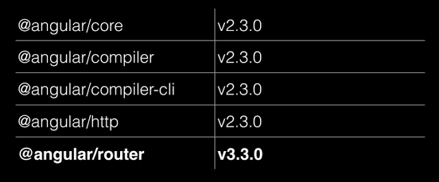

# Angular 的版本号与发布周期

初稿日期：2016年12月15日

## 读者指引
阅读本文需要读者对 [semver][]（semantic versioning，语义化版本）有一定了解。

## 写作原因
听说 Angular 要出 version 4 了。  
如果你一直关注 Angular 的官方博客，一定知道 Angular 从 v2.0.0 开始已经在使用 semver 了，所以不会觉得出个 MAJOR version 有什么值得大惊小怪的。可是，version 3 哪去了？
如果你最近很忙，9月份开始就没看过 Angular 的博客，而且你正在将自己的 Angular 1 项目迁移到 Angular 2，深知迁移过程是一个...额...过程，当你听到 Angular 要出 version 4 的时候，笑 cry 吧。  
其实，大家大可不必担心 Angular 版本跟新过快。要了解 Angular 的 version 4 是怎么来的，你可以翻阅 Angular 的博客（相关文章列表在文末参考列表），或者继续阅读本文。  
本文主要是摘译 Angular 官方博客中关于 Angular 使用 semver 以及发布计划的内容。

## Angular 发布计划
先来看两个表：  
表1，Angular 发布计划 weekly：  
   
大概意思就是：在2016年12月14日，我们可以拿到 v2.3.1 以及 v4.0.0-beta0。
用 `npm show` 来验证一下：
```
> npm show @angular/core time

  { ... ,
    '2.0.0': '2016-09-15T02:32:24.032Z',
    ... ,
    '4.0.0-beta.0': '2016-12-15T00:34:53.925Z',
    '2.3.1': '2016-12-15T02:26:53.076Z' }
```
12月15日？好像逾期了。换成加州时间就是14日了，准时。  

= = = = = 分隔线 = = = = = =  
表2，Angular MAJOR 版本发布计划：  
   
Version 4？不是事儿。 

为什么会有这样两个表呢？

## 为什么有这样的发布计划
先看2016年9月14日的博文，《[Angular, version 2: proprioception-reinforcement][]》，其中有一段：
> Semantic Versioning  
... To make it easy to manage dependencies on stable Angular releases, starting today with Angular 2.0.0, we will move to semantic versioning.  Angular versioning will then follow the MAJOR.MINOR.PATCH scheme as described by semver:

这段是说，从 v2.0.0 开始，Angular 将使用 semver（具体内容参见[链接][semver]），即版本号会遵从 `MAJOR.MINOR.PATCH` 的格式，比如：  
   

= = = = = 分隔线 = = = = = =  
然后来到2016年10月7日，《[Versioning and Releasing Angular][]》：
> Time-based Release Cycles  
... In general you can expect a patch release each week, about 3 minor updates and one major update every 6 months. We’re also baking quality into our schedule by providing Betas and RCs for each major and minor release.  

这段是说：每周发布一个 PATCH 版本，每6个月发布3个 MINOR 版本（译注：MINOR 版本的发布间隔没有说明）以及1个 MAJOR 版本。MINOR 以及 MAJOR 版本正式发布之前，会发布相应的 Betas、RCs。  
现在回过头看表1，我们就知道了：v2.3.0 这个 PATCH 版本发布后，每周有一个新的 PATCH 版本；每个 MAJOR 版本之间有3个 MINOR 版本，所以 v2.3 是 v2 这个 MAJOR 版本里的最后一个 MINOR 版本；2016年9月14日发布的 v2.0.0 ，那么6个月以后，即2017年3月14日前后应该有 v3。可是，为什么是 v4.0.0 呢？

= = = = = 分隔线 = = = = = =  
然后是2016年12月13日，《[Ok... let me explain: it's going to be Angular 4.0, or just Angular][]》:  
> Why not version 3 then?  
The core Angular libraries live in one single GitHub repository at github.com/angular/angular. All of them are versioned the same way, but distributed as different NPM packages:  
    
Due to this misalignment of the router package’s version, the team decided to go straight for Angular v4.

原来是 @angular/router 跑得太快，已经是 v3 了，统一起见，直接上 v4。  

## 哪些 package 会遵从这样的发布计划
Angular 由若干部分构成，比如 @angular/core, @angular/router，等等。哪些 package 的版本号会同步更新呢？参见 [Supported Public API Surface of Angular][]。  

## 如何应对版本变更
PATCH、MINOR 版本更新发布的时候，都是向下兼容的，拿过来用就是了。升级小版本的时候，如果遇到 'UNMET PEER DEPENDENCY' 或者其他版本问题的时候，可以参见木丁糖的《[如何优雅升级ng2小版本][]》。  

MAJOR 版本更新时怎么办？这方面大家也不必担心，Angular Team 会在废除某个 API 的之前，给出升级路径，并继续支持旧 API 一段时间，为开发者预留足够的升级时间。详见《[Versioning and Releasing Angular][]》中的 Deprecation Policy。

## 总结
甲：“听说 Angular 要出 v4 了？”  
乙：“嗯，怎么啦？2018年9、10月还要出 v7 呢！”

## 参考
- [semver][]
- [Angular, version 2: proprioception-reinforcement][]
- [Versioning and Releasing Angular][]
- [Ok... let me explain: it's going to be Angular 4.0, or just Angular][]
- [Supported Public API Surface of Angular][]
- [如何优雅升级ng2小版本][]

[semver]: (http://semver.org/lang/zh-CN/)
[Angular, version 2: proprioception-reinforcement]: (angularjs.blogspot.com/2016/09/angular2-final.html)
[Versioning and Releasing Angular]: (http://angularjs.blogspot.com/2016/10/versioning-and-releasing-angular.html)
[Ok... let me explain: it's going to be Angular 4.0, or just Angular]: (http://angularjs.blogspot.com/2016/12/ok-let-me-explain-its-going-to-be.html)
[Supported Public API Surface of Angular]: (https://github.com/angular/angular/blob/master/docs/PUBLIC_API.md)
[如何优雅升级ng2小版本]: (https://wx.angular.cn/library/article/%E5%A6%82%E4%BD%95%E4%BC%98%E9%9B%85%E5%8D%87%E7%BA%A7ng2%E5%B0%8F%E7%89%88%E6%9C%AC)
